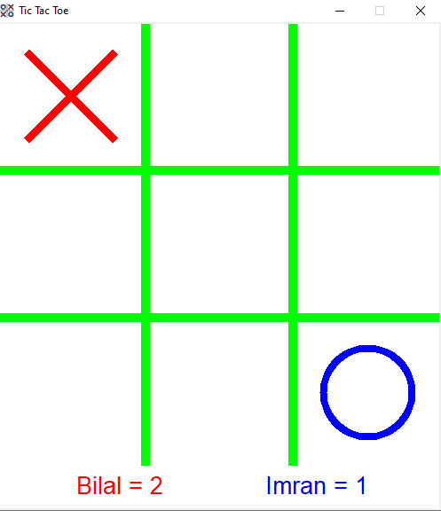

# TicTacToe-Canvas-Tkinter

A simple Tic Tac Toe game built using Python's Tkinter library for the GUI and Pillow library.

## Getting Started

### Prerequisites

- Python 3.x
- Tkinter
- Pillow

## How to Play
- The game is played on a 3x3 grid.
- The player 1 is X and the player 2 is O.
- Players take turns placing their marks in the grid.
- The first player to get three of their marks in a row wins.

## Contributing

Feel free to contribute

1. Fork it.
2. Create your feature branch (`git checkout -b my-new-awesome-feature`)
3. Commit your changes (`git commit -am 'Added <xyz> feature'`)
4. Push to the branch (`git push origin my-new-awesome-feature`)
5. Create new Pull Request

## Authors

* **Syed Ashar Ali** -
