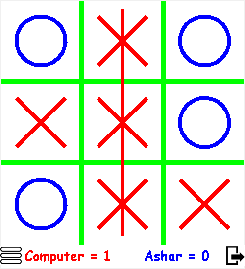

# TicTacToe-Canvas-Tkinter

A Tic Tac Toe game built on Canvas using Python's Tkinter library for the GUI.

## Getting Started

### Prerequisites

- Python 3.x
- Tkinter
- Pillow

## Features

- Play against a computer opponent who is skilled and makes non-random moves.
- Play against your friend on the same board.

## How to Play
- The game is played on a 3x3 grid.
- The player 1 is X and the player 2 is O.
- Players take turns placing their marks in the grid.
- The first player to get three of their marks in a row wins.

-
-
-
-
-
-
-
-
-

## Authors

* **Syed Ashar Ali** -
